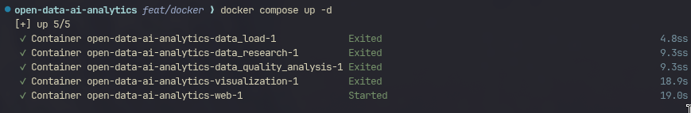
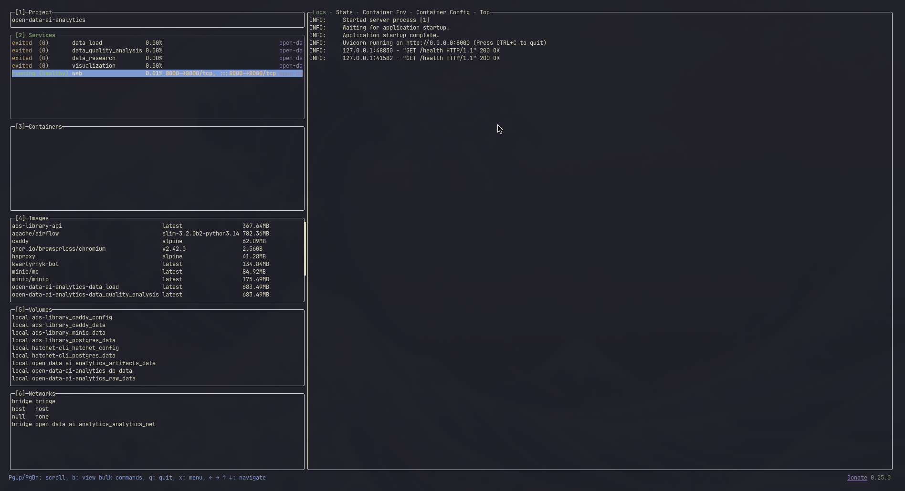

# Report: Intro to Docker (Containerization of Project Modules)

[This repository on GitHub](https://github.com/rojikaru/open-data-ai-analytics)

## What I learned

- **Containerization basics**: how to package each module into an isolated image and run the whole pipeline with a single `docker compose` command.
- **Service orchestration**: how to define multi-container dependency flow with `depends_on`, shared `volumes`, and one user-defined network.
- **Data exchange patterns**: how to combine SQLite persistence and shared artifact volumes for inter-service communication.
- **Web presentation**: how to expose generated outputs (reports and plots) through a dedicated web container.

## What I have done

### 1. Implemented containerized services

The project was split into containerized services:

- `data_load` — downloads dataset and imports CSV into SQLite.
- `data_quality_analysis` — computes quality checks (missing values, duplicates, validity metrics).
- `data_research` — computes baseline statistics and research summaries.
- `visualization` — generates at least two plots (`ownership_by_region.png`, `top_vehicle_types.png`).
- `web` — FastAPI + Jinja2 interface to view loaded data, quality outputs, research outputs, and visualizations.

### 2. Added Dockerfiles for all services

- `src/data_load/Dockerfile`
- `src/data_quality_analysis/Dockerfile`
- `src/data_research/Dockerfile`
- `src/visualization/Dockerfile`
- `web/Dockerfile`

All images use `uv` Alpine base (`ghcr.io/astral-sh/uv:python3.14-alpine`).

### 3. Added Compose orchestration

Main runtime file: `compose.yaml`.

Orchestration details:

- build contexts and Dockerfiles are service-specific;
- shared named volumes:
  - `raw_data` (dataset files),
  - `db_data` (SQLite),
  - `artifacts_data` (reports and images);
- one bridge network: `analytics_net`;
- startup order:
  - `data_load` first,
  - then `data_quality_analysis` + `data_research`,
  - then `visualization`,
  - finally `web`;
- published port:
  - `8000:8000` for web interface.

### 4. Prepared project documentation

Root `README.md` contains:

- project structure;
- service list;
- run commands (`docker compose up --build`, `docker compose down`);
- output artifacts and volume layout;
- port information for web service.

### 5. CSV data sample

Dataset example file used in project:

- `data/raw/reestrtz2026/reestrtz01.01.2026.csv`

## Screenshots

### 1) `docker compose up` output



### 2) Running containers list



### 3) Web interface in browser

Web screenshot is required by the assignment and should be added as:

- `reports/labs/intro-to-docker/web-ui.png`

Then embed using:

```markdown

```

## Service interaction overview

```plaintext
data_load -> SQLite (db_data) + artifacts_data
data_quality_analysis -> reads SQLite, writes quality reports to artifacts_data
data_research -> reads SQLite, writes research reports to artifacts_data
visualization -> reads SQLite, writes plots to artifacts_data
web -> reads db_data + artifacts_data and serves UI on port 8000
```

## Short summary (required)

### Created services

- `data_load`
- `data_quality_analysis`
- `data_research`
- `visualization`
- `web`

### How interaction is organized

- Shared persistence via SQLite in `db_data` volume.
- Shared artifacts via `artifacts_data` volume.
- Ordered startup in `compose.yaml` through `depends_on`.
- Single entrypoint for local run: `docker compose up --build`.

### Difficulties encountered

- **Compose build contexts**: using per-module context can break shared `src.*` imports; fixed by using `context: ./src` for Python module services.
- **Environment parsing**: quote-char value in `.env` needed proper escaping/quoting.
- **Data flow consistency**: modules initially loaded CSV independently; fixed by switching downstream modules to SQLite-backed reads.

## Output of `git log --oneline --graph --all`

```plaintext
* cd01b3d (HEAD -> feat/docker, tag: 0.4.0) bump: version 0.3.0 → 0.4.0
* f17b074 docs: update README
* 3b1556d ci(docker): add Docker compose configuration and .dockerignore for services
* 8fcbab8 ci(web): add Dockerfile
* 1eebd43 feat: add web console
* 2d06768 ci(visualization): add Dockerfile and implement data loading from SQLite with enhanced visualization outputs
* 18e4244 ci(data-research): add Dockerfile and implement data loading from SQLite with summary output
* b8bf033 ci(data-quality): add Dockerfile, report generation and db usage
* 629b947 ci(data-load): add Dockerfile and enhance data loading with summary output
* b43db2b chore: update environment & constants for db
* 27ee293 feat: add sqlite facade
* 20d0313 (origin/main, origin/HEAD, main) fix: switch self-host CI to uv
```
