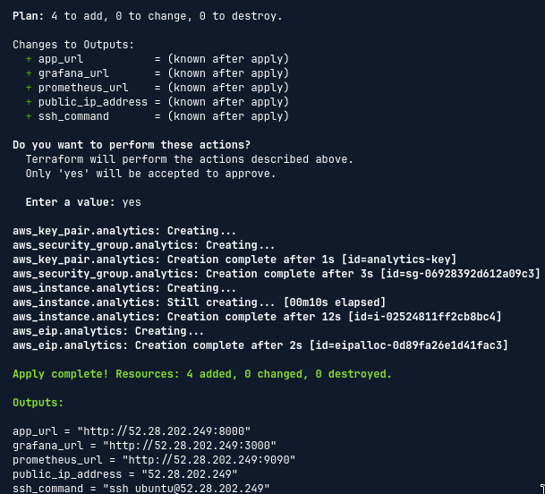
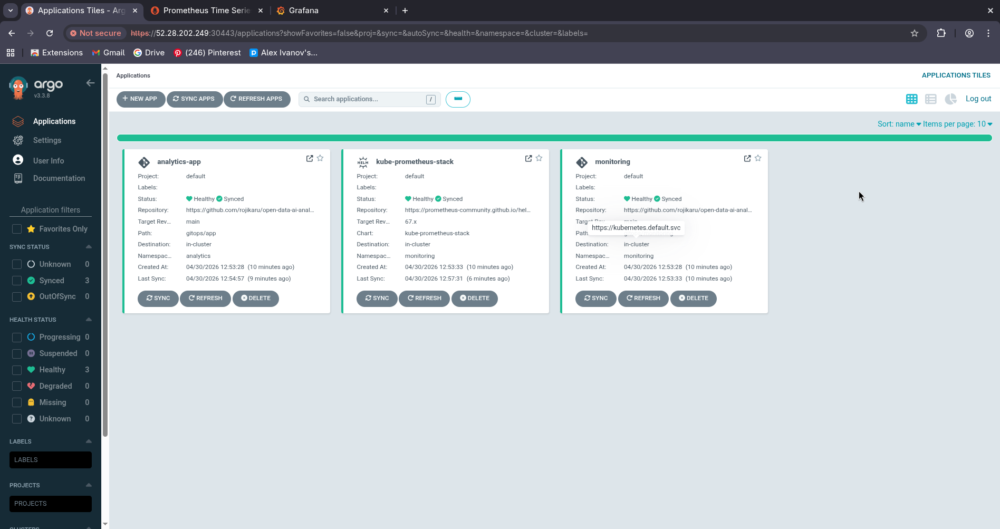
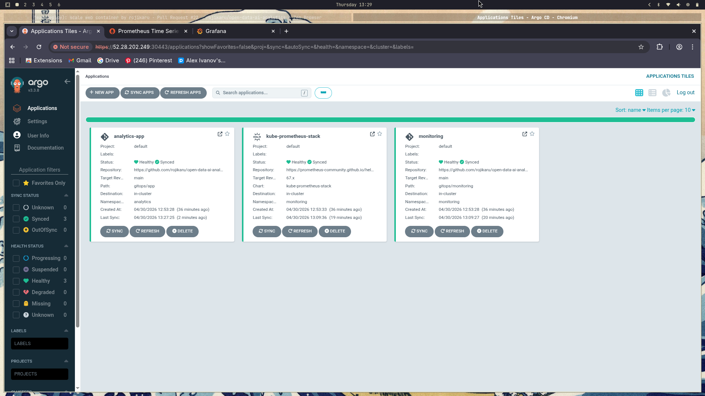
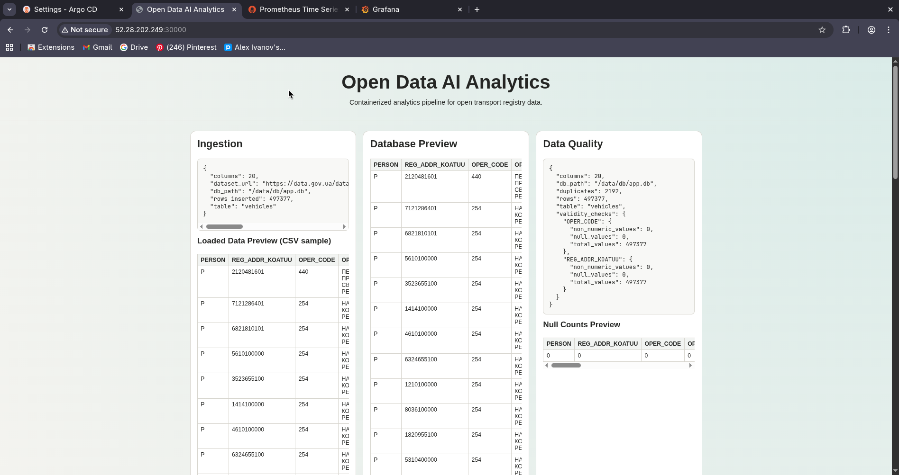
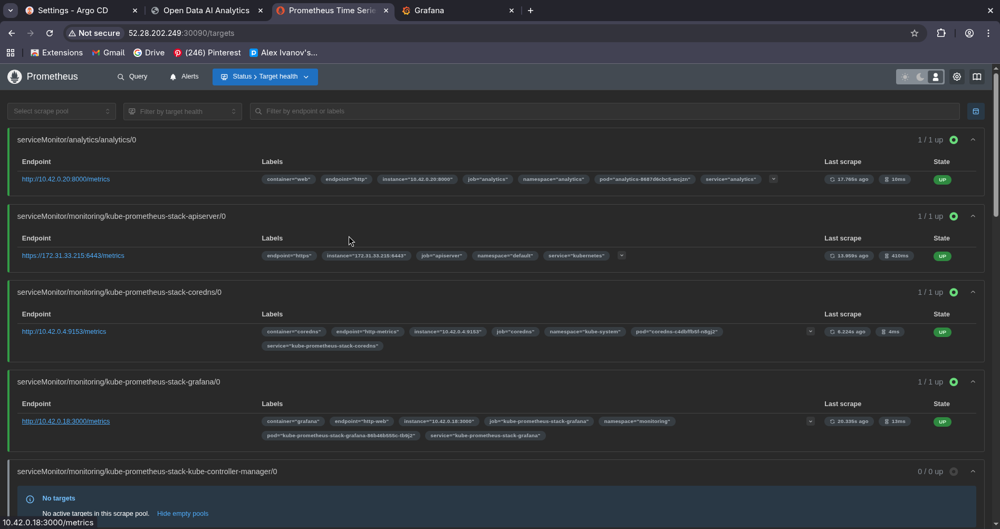
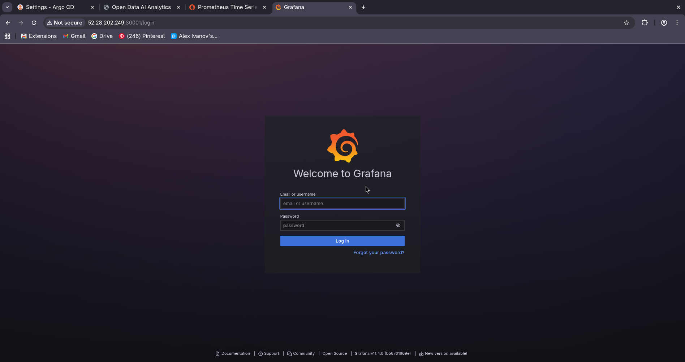
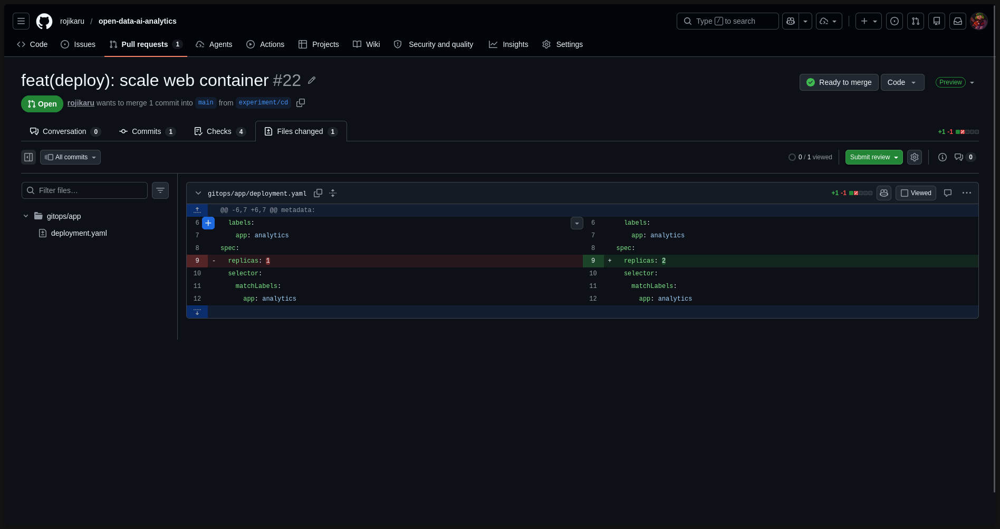
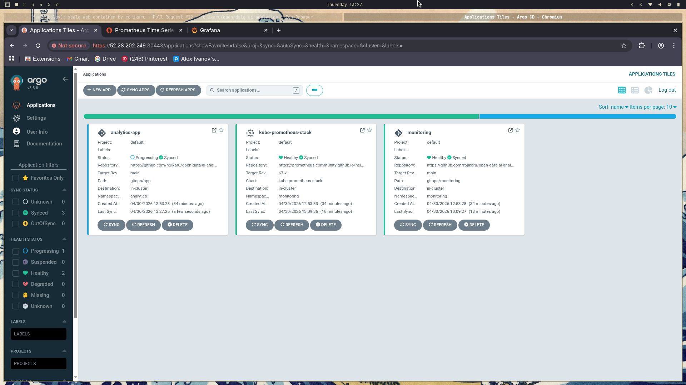

# Report: GitOps with Argo CD on Kubernetes

[This repository on GitHub](https://github.com/rojikaru/open-data-ai-analytics)

## What I learned

- **GitOps core principle**: Git is the single source of truth for the desired state of the system. Changes are made via commits, not via direct `kubectl apply` calls. A reconciliation agent continuously compares the cluster state to the Git state and corrects any drift.
- **Argo CD**: a Kubernetes-native GitOps controller. It watches a Git repository branch, detects differences between the declared manifests and the live cluster, and applies changes automatically. The web UI shows sync status, health, and a visual resource graph for every managed application.
- **App-of-Apps pattern**: instead of registering each application separately in Argo CD, a single root `Application` resource points to a directory of other `Application` manifests. Argo CD discovers and manages all child applications automatically, making the bootstrap a single `kubectl apply`.
- **k3s**: a lightweight, CNCF-certified Kubernetes distribution that runs as a single binary. It is functionally equivalent to full Kubernetes for this lab while using far less memory and having a much shorter startup time. It includes Traefik as an ingress controller and uses `containerd` as the container runtime.
- **Cloud-agnosticism**: the lab specification references Azure VM. This implementation targets AWS EC2. The entire GitOps layer — k3s, Argo CD, and all `gitops/` manifests — is identical regardless of cloud provider. The only infrastructure difference is the Terraform provider and VM provisioning details. This demonstrates a core GitOps benefit: the deployment target is interchangeable, and the source of truth remains Git.
- **GitHub webhooks**: instead of polling (Argo CD checking Git every N minutes), a webhook fires an HTTP POST to the Argo CD API server on every push. This reduces sync latency from minutes to seconds and eliminates unnecessary API calls.
- **initContainers for pipeline ordering**: Kubernetes `initContainers` run sequentially and must exit with code 0 before the main container starts. This is used to model the data pipeline dependency: `data_load` → `data_quality_analysis` → `data_research` → `visualization` → `web`. A shared `emptyDir` volume passes the SQLite database and artifact files between stages.
- **kube-prometheus-stack**: a Helm chart that bundles Prometheus, Grafana, Alertmanager, kube-state-metrics, and Node Exporter into a single deployment. Argo CD deploys it using its native Helm support — no separate Flux or Helm operator needed. Grafana dashboards are provisioned via ConfigMaps with the label `grafana_dashboard: "1"`, which the Grafana sidecar imports automatically.
- **ServiceMonitor**: a Prometheus Operator CRD that declaratively configures scrape targets. Adding a `ServiceMonitor` to the `gitops/app/` directory is all that is needed to tell Prometheus to scrape `/metrics` from the web service — no manual `prometheus.yml` edits required.

## What I have done

### 1. Prepared the GitOps repository structure

A `gitops/` directory was added to the repository with the following layout:

```plaintext
gitops/
├── app/
│   ├── namespace.yaml        # analytics namespace
│   ├── configmap.yaml        # shared env vars (DB_PATH, ARTIFACTS_ROOT, etc.)
│   ├── deployment.yaml       # 4 initContainers + web main container
│   ├── service.yaml          # NodePort :30000 → web :8000
│   └── servicemonitor.yaml   # Prometheus scrape config for /metrics
├── monitoring/
│   ├── namespace.yaml        # monitoring namespace
│   ├── app.yaml              # Argo CD Application → kube-prometheus-stack Helm chart
│   └── dashboard-cm.yaml     # Grafana dashboard ConfigMap (auto-imported by sidecar)
└── argocd/
    ├── root-app.yaml         # App-of-Apps root (watches gitops/argocd/)
    ├── app.yaml              # analytics-app Application (watches gitops/app/)
    └── monitoring.yaml       # monitoring Application (watches gitops/monitoring/)
```

### 2. Configured the analytics Deployment

`gitops/app/deployment.yaml` defines a single Deployment with:

- **4 sequential initContainers**: `data_load`, `data_quality_analysis`, `data_research`, `visualization` — each uses `imagePullPolicy: Never` (images built and imported locally on the node) and mounts a shared `emptyDir` volume at `/data`.
- **Main container**: `web` (FastAPI on port 8000), starts only after all initContainers succeed, also mounts `/data` to read the SQLite database and artifacts.
- **Health probes**: readiness and liveness probes on `GET /health`.

### 3. Set up Argo CD with App-of-Apps

Argo CD was installed into the `argocd` namespace. The root Application watches `gitops/argocd/` on the `main` branch and manages two child Applications:

| Application | Source | Destination |
| --- | --- | --- |
| `analytics-app` | `gitops/app/` (plain YAML) | namespace `analytics` |
| `monitoring` | `gitops/monitoring/` (Argo CD Helm) | namespace `monitoring` |

Both Applications have `syncPolicy.automated` enabled with `prune: true` and `selfHeal: true`.

### 4. Deployed monitoring via Argo CD native Helm

`gitops/monitoring/app.yaml` is an Argo CD `Application` that points directly at the `kube-prometheus-stack` Helm chart in the Prometheus Community registry. Key Helm values:

- Grafana on NodePort 30001, Prometheus on NodePort 30090
- `serviceMonitorSelectorNilUsesHelmValues: false` + empty selectors — Prometheus discovers `ServiceMonitor` resources in all namespaces
- `sidecar.dashboards.searchNamespace: ALL` — Grafana imports dashboard ConfigMaps from any namespace
- Alertmanager disabled to keep the setup lean

The Grafana dashboard (`gitops/monitoring/dashboard-cm.yaml`) provisions two panels automatically:

| Panel | Query |
| --- | --- |
| HTTP Request Rate | `rate(http_requests_total[5m])` |
| Request Latency p99 | `histogram_quantile(0.99, rate(http_request_duration_seconds_bucket[5m]))` |

### 5. Configured GitHub webhook for instant sync

GitHub repo → Settings → Webhooks → push event → payload URL `https://<EC2-IP>:30443/api/webhook`. The webhook secret is stored in the `argocd-secret` Kubernetes secret. Every push to `main` triggers an immediate Argo CD sync with no polling delay.

### 6. Updated Terraform and cloud-init

`infra/terraform/main.tf` — added Security Group ingress rules for port 6443 (k3s API server) and the full NodePort range 30000–32767.

`infra/terraform/cloud-init.yaml.tpl` — replaced the Docker Compose startup with a full k3s + Argo CD bootstrap sequence:

1. Install Docker (for building images on the node)
2. Clone repository to `/opt/app`
3. Install k3s
4. Build all 5 Docker images and import into k3s containerd via `docker save | k3s ctr images import -`
5. Install Argo CD into namespace `argocd`
6. **Wait** for argocd-server pod to be Ready (`kubectl wait`)
7. Patch argocd-server to NodePort 30443
8. Apply root-app, app, and monitoring Applications — Argo CD takes over from here

## Difficulties encountered

- **cloud-init race condition**: the initial implementation applied the Argo CD root Application immediately after `kubectl apply` for Argo CD itself, without waiting for the pods to be ready. The Applications were created but never synced because the Argo CD controllers were not yet running. Fixed by inserting `kubectl wait --for=condition=Ready pod -l app.kubernetes.io/name=argocd-server -n argocd --timeout=300s` before the Application bootstraps.
- **Namespace ordering with raw `kubectl apply -f <directory>`**: applying the entire `gitops/app/` directory in one command caused the ConfigMap and Deployment to fail with "namespace not found" because `namespace.yaml` was not applied first. Argo CD handles this automatically through retry logic; for local testing, applying `namespace.yaml` separately first is required.
- **ServiceMonitor CRD not available during dry-run**: `kubectl apply --dry-run=client -f gitops/app/` fails on `servicemonitor.yaml` until the Prometheus Operator CRDs are installed. This is expected — the CRD is created by the `monitoring` Application. Locally, the CRD can be installed separately or the file excluded from dry-run validation.
- **kube-prometheus-stack ApplicationSet annotation too large**: Argo CD logs `The CustomResourceDefinition "applicationsets.argoproj.io" is invalid: metadata.annotations: Too long`. This is a known cosmetic issue with large Helm charts — the `last-applied-configuration` annotation exceeds 256 KB. The CRD is created successfully and Argo CD functions normally. Adding `ServerSideApply=true` to `syncOptions` avoids this warning on future syncs.

## Architecture overview

```plaintext
AWS EC2 Instance (t3a.large, Ubuntu 24.04)
└── k3s (Kubernetes)
    ├── namespace: argocd
    │   └── Argo CD (watches GitHub main branch via webhook)
    │       ├── root-app       → gitops/argocd/
    │       ├── analytics-app  → gitops/app/
    │       └── monitoring     → gitops/monitoring/
    │
    ├── namespace: analytics
    │   └── Deployment: analytics
    │       ├── initContainer: data-load          (builds SQLite DB)
    │       ├── initContainer: data-quality-analysis
    │       ├── initContainer: data-research
    │       ├── initContainer: visualization      (generates PNG plots)
    │       └── container: web                    :8000 → NodePort 30000
    │
    └── namespace: monitoring
        ├── Prometheus   :9090 → NodePort 30090
        └── Grafana      :80   → NodePort 30001
```

Ports 6443 and 30000–32767 are open in the AWS Security Group.

## Screenshots

### 1) Successful Terraform Deployment



### 2) Argo CD UI — applications registered



### 3) Argo CD — all applications Synced and Healthy



### 3) Web application running



### 5) Prometheus targets — analytics service UP



### 6) Grafana dashboard with live metrics



### 7) Auto-sync demo — scaling to 2 replicas



### 8) Argo CD — sync in progress



## Output of `git log --oneline --graph`

```plaintext
* c2584fb (HEAD -> docs/gitops, origin/main, origin/HEAD, main) feat(deploy): scale web container
| * 6a4c1a0 (origin/experiment/cd, experiment/cd) feat(deploy): scale web container
|/  
* 905d84a fix(deploy): await for Argo to be ready, then deploy apps in sequence
| * f7abede (origin/hotfix/cloud-init, hotfix/cloud-init) fix(deploy): await for Argo to be ready, then deploy apps in sequence
|/  
* c04bb57 chore(gitops): re configure cloud-init
* 75ac2e7 chore(gitops): allow inbound traffic on Argo CD & k8s ports
* 004425c refactor(docs): monitoring report markdown lint warnings
* 363e577 docs: update README
* 2b5555f feat(gitops): add argocd k8s spec
* 72f37e1 feat(gitops): add monitoring services k8s spec
* 59e592c feat(gitops): add application k8s spec
* f3638cf docs: update README
| * 907b065 (origin/feat/gitops, feat/gitops) chore(gitops): re configure cloud-init
| * b5c79c8 chore(gitops): allow inbound traffic on Argo CD & k8s ports
| * dbccbbe refactor(docs): monitoring report markdown lint warnings
| * 0edab9b docs: update README
| * 5c9acdd feat(gitops): add argocd k8s spec
| * 731b4b1 feat(gitops): add monitoring services k8s spec
| * a6edadf feat(gitops): add application k8s spec
| * 4c5a25a docs: update README
|/ 
```
