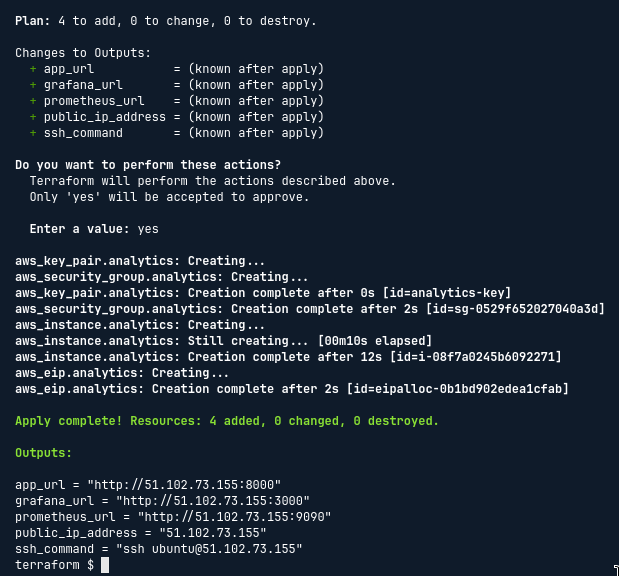
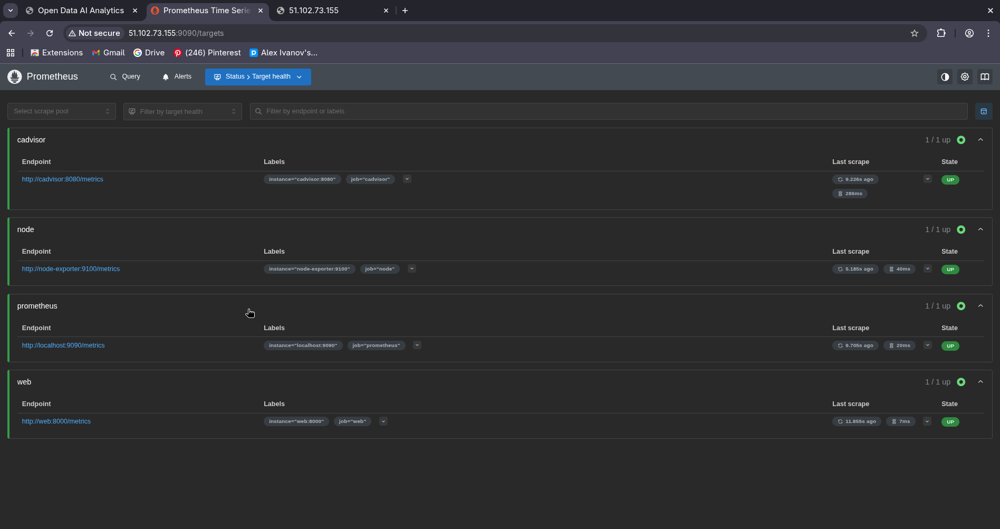
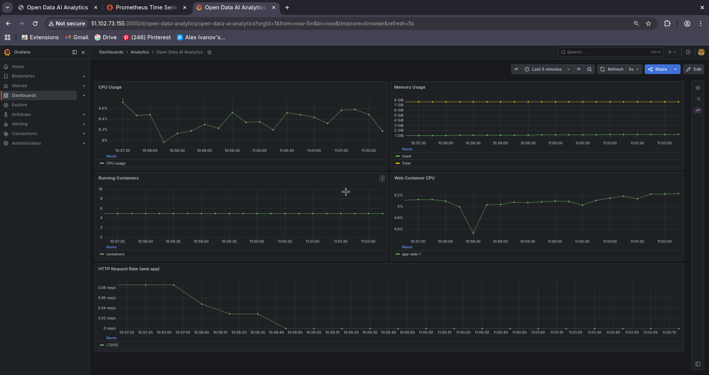
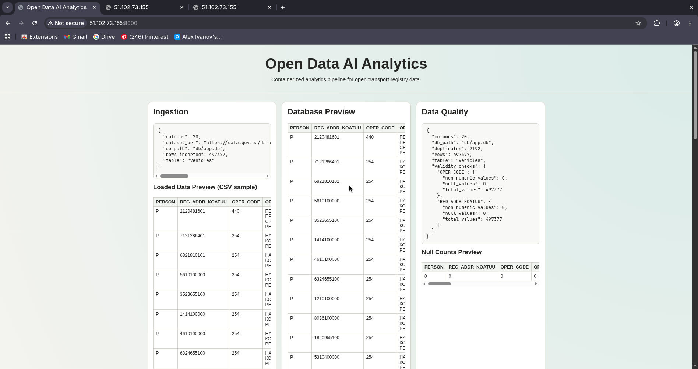

# Report: Monitoring a Containerized Project with Prometheus and Grafana

[This repository on GitHub](https://github.com/rojikaru/open-data-ai-analytics)

## What I learned

- **Observability basics**: after a service is deployed it needs to be actively watched — CPU spikes, memory pressure, and request failures are only visible if something is collecting and storing measurements over time.
- **Prometheus pull model**: Prometheus periodically scrapes HTTP endpoints that expose metrics in its text format. Each scrape target is called a *job*; each host inside a job is a *target*. Configuration lives in `prometheus.yml` under `scrape_configs`.
- **Exporters**: most infrastructure components (Linux kernel, Docker) do not expose Prometheus metrics natively. *Node Exporter* wraps Linux `/proc` and `/sys` counters; *cAdvisor* wraps Docker container statistics. Both expose a `/metrics` HTTP endpoint that Prometheus scrapes.
- **`prometheus_client` library**: a Python package that lets any application register counters, histograms, and gauges and expose them as a `/metrics` endpoint compatible with Prometheus. Mounting `make_asgi_app()` onto a FastAPI app adds this endpoint with zero extra infrastructure.
- **Grafana provisioning**: Grafana can be given datasources and dashboards at startup through YAML and JSON files mounted into `/etc/grafana/provisioning/`. This replaces manual UI configuration and makes the setup reproducible and version-controlled.
- **Datasource UID pinning**: Grafana auto-generates a UID for each datasource unless one is specified explicitly. Dashboard JSON panels reference datasources by UID, so a mismatch causes all panels to silently show no data. Pinning `uid: prometheus` in the datasource YAML makes the dashboard JSON portable.
- **Shared Docker networks**: two separate Compose stacks can communicate if they are both connected to the same Docker bridge network. The monitoring stack joins `app_analytics_net` (created by the main `compose.yaml`) so Prometheus can reach the `web` container by its service name.
- **Cloud-init sequencing**: cloud-init `runcmd` entries run in order. Placing the monitoring `docker compose up` after the application `docker compose up` ensures both stacks start automatically on VM boot.

## What I have done

### 1. Added `/metrics` endpoint to the FastAPI web app

`prometheus_client>=0.21` was added to `pyproject.toml`. In `web/app.py`:

- Two metrics were registered: `http_requests_total` (Counter, labelled by method / endpoint / status) and `http_request_duration_seconds` (Histogram, labelled by endpoint).
- `make_asgi_app()` was mounted at `/metrics` so Prometheus can scrape the app directly.
- The `GET /` handler was instrumented to record latency and increment the request counter on every response.

### 2. Created the monitoring stack

A dedicated `monitoring/` directory was added to the repository:

```plaintext
monitoring/
├── prometheus/
│   └── prometheus.yml
├── grafana/
│   └── provisioning/
│       ├── datasources/
│       │   └── datasource.yaml
│       └── dashboards/
│           ├── dashboard.yaml
│           └── analytics.json
└── docker-compose.monitoring.yml
```

`docker-compose.monitoring.yml` defines four services:

| Service | Image | Purpose |
| --- | --- | --- |
| `prometheus` | `prom/prometheus` | Scrapes and stores metrics |
| `grafana` | `grafana/grafana` | Visualisation and dashboards |
| `node-exporter` | `prom/node-exporter` | Exposes Linux host metrics |
| `cadvisor` | `gcr.io/cadvisor/cadvisor` | Exposes Docker container metrics |

### 3. Configured Prometheus scrape targets

`prometheus/prometheus.yml` defines four jobs:

```yaml
scrape_configs:
  - job_name: prometheus      # Prometheus self-monitoring
  - job_name: node            # Linux host via Node Exporter
  - job_name: cadvisor        # Docker containers via cAdvisor
  - job_name: web             # FastAPI app /metrics endpoint
```

All intervals are 15 s. The `web` job uses `metrics_path: /metrics` and targets `web:8000` — reachable because both Compose stacks share the `app_analytics_net` Docker network.

### 4. Set up Grafana auto-provisioning

**Datasource** (`datasources/datasource.yaml`): declares Prometheus as the default datasource with a pinned `uid: prometheus` so dashboard panels can reference it reliably.

**Dashboard provider** (`dashboards/dashboard.yaml`): tells Grafana to scan `/etc/grafana/provisioning/dashboards` for JSON files on every startup.

**Dashboard** (`dashboards/analytics.json`): five panels are provisioned automatically:

| Panel | Query |
| --- | --- |
| CPU Usage | `1 - avg(rate(node_cpu_seconds_total{mode="idle"}[2m]))` |
| Memory Usage | `node_memory_MemTotal_bytes - node_memory_MemAvailable_bytes` |
| Running Containers | `count(count by (name) (container_last_seen{name!=""}))` |
| Web Container CPU | `rate(container_cpu_usage_seconds_total{name=~".*web.*"}[2m])` |
| HTTP Request Rate | `sum(rate(http_requests_total[2m])) by (endpoint, status)` |

### 5. Updated Terraform and cloud-init

`infra/terraform/main.tf` — added Security Group ingress rules for port 3000 (Grafana) and port 9090 (Prometheus).

`infra/terraform/variables.tf` — added `grafana_port` (default 3000) and `prometheus_port` (default 9090).

`infra/terraform/outputs.tf` — added `grafana_url` and `prometheus_url` outputs.

`infra/terraform/cloud-init.yaml.tpl` — added a second `docker compose up` command for the monitoring stack, executed after the application stack.

## Difficulties encountered

- **Grafana "create dashboard" prompt despite provisioning files being present**: the `analytics.json` file contained `"id": null` as an explicit field, which Grafana's provisioning loader silently rejected. Removing that field fixed the issue. The panel datasource references also had to be changed from UID objects to the plain datasource name string for cross-version compatibility.
- **Schema validator false positive**: the datasource provisioning file was named `prometheus.yaml`, which the IDE matched against the Prometheus config JSON schema, producing spurious errors. Renaming it to `datasource.yaml` resolved the warning without affecting Grafana's behaviour (Grafana loads all `.yaml` files from the provisioning directory regardless of name).
- **Shared Docker network naming**: the main Compose stack creates a network named `<project>_analytics_net`. Because cloud-init runs from `/opt/app`, Docker Compose uses `app` as the project name, making the network `app_analytics_net`. This name must be referenced explicitly in `docker-compose.monitoring.yml` as an external network.
- **`git pull` permission denied on the VM**: the repository was cloned by `root` during cloud-init, so all `.git/` files were owned by root. Running `sudo chown -R ubuntu:ubuntu /opt/app` restored access for the `ubuntu` user.

## Architecture overview

```plaintext
AWS EC2 Instance (t3a.large, Ubuntu 24.04)
└── Docker
    ├── app_analytics_net (bridge)
    │   ├── web              :8000  → dashboard + /metrics
    │   ├── data_load
    │   ├── data_quality_analysis
    │   ├── data_research
    │   ├── visualization
    │   ├── prometheus       :9090  ← scrapes web, cadvisor
    │   └── cadvisor         :8080
    │
    └── monitoring_net (bridge)
        ├── prometheus       :9090  ← scrapes node-exporter, itself
        ├── grafana          :3000
        ├── node-exporter    :9100
        └── cadvisor         :8080
```

Ports 3000 and 9090 are open in the AWS Security Group.

## Screenshots

### 1) Successful deployment — containers running



### 2) Prometheus targets — all jobs UP



### 3) Grafana dashboard with live metrics



### 4) Web application dashboard



## Output of `git log --oneline --graph`

```plaintext
* e821e0c (HEAD -> docs/monitoring, origin/main, origin/HEAD, main) fix(monitoring): grafana datasource
| * 5223329 (origin/hotfix/grafana, hotfix/grafana) fix(monitoring): grafana datasource
|/  
* ff4883f fix(monitoring): grafana datasource
| * 58ff904 (origin/feat/monitoring, feat/monitoring) fix(monitoring): grafana datasource
|/  
* 18653a5 chore(monitoring): open monitoring services inbound traffic
* b576f7a chore(monitoring): start monitoring compose cluster
* 2253199 feat(monitoring): define monitoring compose cluster
* 27be6a3 feat(monitoring): define grafana dashboards
* 65538ed feat(monitoring): define prometheus targets
* 5318261 feat(monitoring): set up prometheus client for perf logs
```
