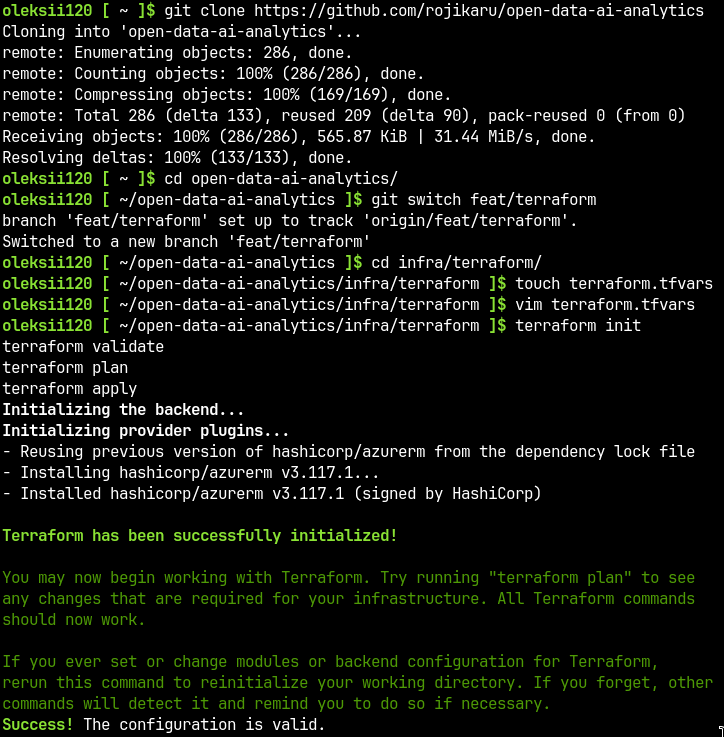
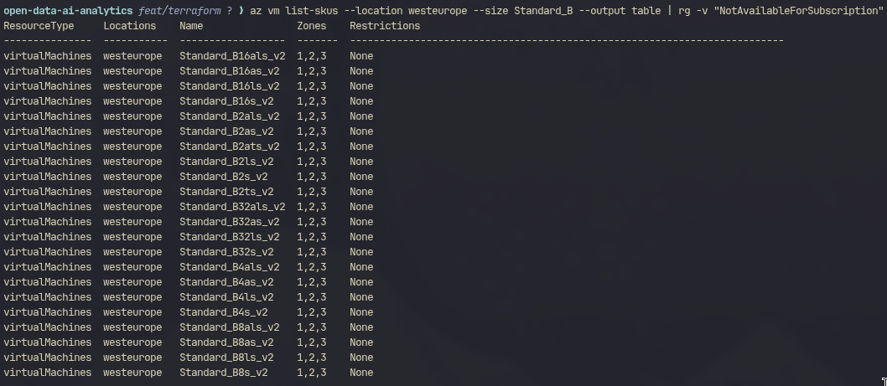
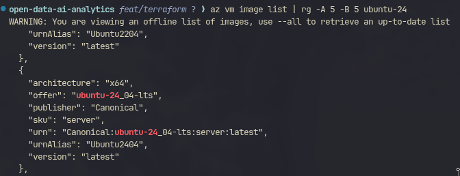
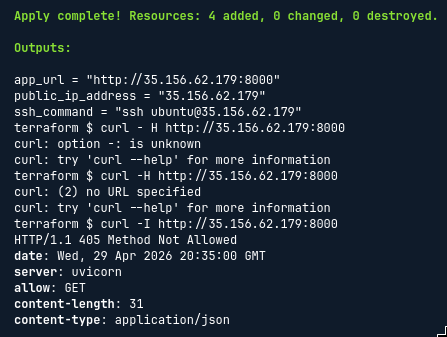
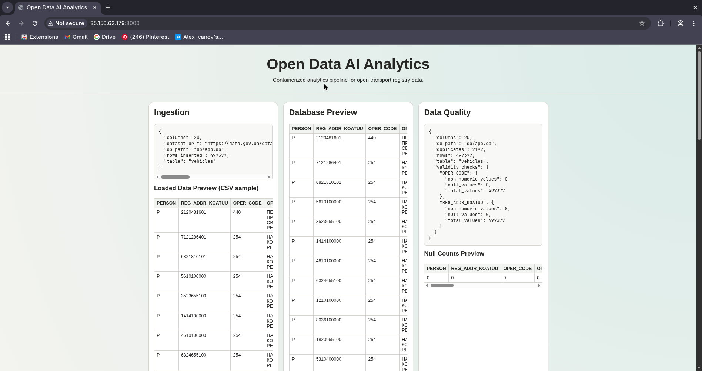

# Report: Intro to Terraform (Cloud Deployment via IaC)

[This repository on GitHub](https://github.com/rojikaru/open-data-ai-analytics)

## What I learned

- **Infrastructure as Code**: how to describe cloud resources declaratively with Terraform and reproduce them consistently across deployments.
- **Cloud-init automation**: how to bootstrap a Linux VM on first boot — installing Docker, cloning the repository, and starting the app — without ever logging in manually.
- **Provider migration**: how to migrate from one cloud provider to another (Azure → AWS) by replacing provider-specific resources while keeping the same variables, outputs, and cloud-init structure.
- **Terraform workflow**: `init → validate → plan → apply → destroy` cycle and how state affects incremental changes.
- **Cloud quota realities**: that student/trial accounts have hard VM quota limits that are not obvious until `apply` fails.

## What I have done

### 1. Created Terraform configuration

All infrastructure code lives in `infra/terraform/`:

- `main.tf` — provider, resources
- `variables.tf` — parameterized inputs
- `outputs.tf` — public IP and app URL
- `cloud-init.yaml.tpl` — VM bootstrap script (templatefile)

### 2. Attempted Azure deployment

The initial implementation targeted Azure using the `azurerm` provider (~3.0). Resources defined:

- `azurerm_resource_group`
- `azurerm_virtual_network` + `azurerm_subnet`
- `azurerm_public_ip` (Static)
- `azurerm_network_security_group` (rules for SSH on 22 and web on 8000)
- `azurerm_network_interface` + NSG association
- `azurerm_linux_virtual_machine` (Ubuntu 24.04, custom_data via cloud-init)

**Obstacles encountered:**

- **Cloud-init header typo**: `# cloud-config` (with space) was silently ignored by cloud-init; fixed to `#cloud-config`.
- **Wrong Docker package**: Ubuntu's `docker.io` package does not include `docker-compose-plugin`; switched to the official Docker apt repository with GPG key setup.
- **Azure image reference**: `Canonical:0001-com-ubuntu-server-jammy:22_04-lts:latest` no longer resolves; found the correct offer/sku by running `az vm image list` with ripgrep filtering.
- **Spot VM quota exceeded**: student subscription had a 3-core LowPriority quota; a 4-core Spot instance was rejected. Removed Spot pricing (`priority`, `eviction_policy`, `max_bid_price`).
- **Bsv2 family quota at zero**: even non-Spot VMs in the `Standard_Bsv2` family were blocked. `az vm list-usage` confirmed 0 quota for every VM family in both `westeurope` and `northeurope`.

Due to exhausted Azure quota on the student subscription, the deployment was migrated to AWS.

### 3. Migrated to AWS

Replaced the Azure provider with `hashicorp/aws` (~5.0). AWS resources:

- `aws_key_pair` — uploads the ed25519 public key
- `aws_security_group` — ingress on TCP 22 and TCP 8000, unrestricted egress
- `data.aws_ami` — latest Ubuntu 24.04 (noble) from Canonical (`099720109477`)
- `aws_instance` — `t3a.large` (2 vCPU, 8 GB RAM), 20 GB gp3 root volume, user_data via cloud-init
- `aws_eip` — static Elastic IP associated to the instance

The `cloud-init.yaml.tpl` was reused without changes.

### 4. cloud-init bootstrap

The [cloud-init](../../../infra/terraform/cloud-init.yaml.tpl) script executed automatically on first VM boot.

### 5. Verified deployment

After `terraform apply` completed, the Elastic IP was taken from the `app_url` output and tested:

```bash
curl http://<PUBLIC_IP>:8000/health
# {"status":"ok"}
```

The full pipeline ran successfully:

- `data_load` downloaded and imported 497 377 rows from `data.gov.ua` into SQLite
- `data_quality_analysis` and `data_research` ran in parallel after `data_load` completed
- `visualization` generated plots
- `web` started and served the dashboard

### 6. Destroyed infrastructure

```bash
terraform destroy
```

All resources removed after the demo.

## Screenshots

### 1) Terraform Cloud Shell session



### 2) Azure VM SKU selection research

During Azure troubleshooting, available VM SKUs were queried to find a compatible instance type.



### 3) Azure image selection research

The correct Ubuntu 24.04 image offer and SKU were identified via `az vm image list`.



### 4) Successful AWS deployment

`terraform apply` completed with public IP and app URL in outputs.



### 5) Web interface

Dashboard accessible at `http://<PUBLIC_IP>:8000`.



## Architecture overview

```plaintext
AWS Cloud
└── EC2 Instance (t3a.large, Ubuntu 24.04)
    ├── Elastic IP (static public address)
    ├── Security Group (TCP 22 + TCP 8000)
    └── Docker Compose
        ├── data_load        → downloads CSV, writes SQLite + artifacts
        ├── data_quality_analysis → reads SQLite, writes quality reports
        ├── data_research    → reads SQLite, writes research summaries
        ├── visualization    → reads SQLite, writes plots
        └── web              → serves dashboard on :8000
```

Data is exchanged through three Docker named volumes: `raw_data`, `db_data`, `artifacts_data`.

## Short summary (required)

### What Terraform creates

AWS resources: Key Pair, Security Group (SSH + web), EC2 instance with Ubuntu 24.04 and 20 GB gp3 disk, Elastic IP. The instance receives the cloud-init script via `user_data`.

### What cloud-init does

On first boot it installs Docker from the official apt repository, enables the Docker service, clones the project from GitHub, copies `.env.example` to `.env`, and runs `docker compose up -d`.

### How the Docker project starts

`docker compose up -d` reads `compose.yaml`. Services start in dependency order: `data_load` → `data_quality_analysis` + `data_research` → `visualization` → `web`. All services share volumes for SQLite and artifact files.

### How deployment was verified

```bash
curl http://<PUBLIC_IP>:8000/health   # returns {"status":"ok"}
```

Browser opened `http://<PUBLIC_IP>:8000` — the full dashboard with data tables, quality report, research summary, and plots was visible.

### Difficulties encountered

- **Azure quota**: student subscription had 0 quota for all VM families — forced migration to AWS.
- **Flaky dataset download**: `data.gov.ua` dropped the connection mid-download on first attempt; resolved by clearing volumes and retrying (`docker compose down -v && docker compose up data_load`).
- **VM undersized**: `t3a.small` (2 GB RAM) OOM-killed containers under Polars load; upgraded to `t3a.large` (8 GB).
- **Stale Docker layer cache**: the VM pulled the old (broken) image from GitHub because fixes were not yet pushed to the remote repo; resolved by pushing all changes before redeploying.
- **Jinja2/Starlette API change**: `TemplateResponse` no longer accepts `request` inside the context dict; fixed by passing it as a positional argument.

## Output of `git log --oneline --graph`

```plaintext
* 6ccb601 (origin/main, origin/HEAD) fix(aws): bigger instance
| * adfdcbb (HEAD -> feat/aws, origin/feat/aws) fix(aws): bigger instance
|/  
* 5785773 (main) docs: update README
* 0e65ce4 chore(deploy): update lockfile
* 4640ef5 chore(deploy): update outputs
* 2428cd6 chore(deploy): update variables
* a128aff feat(infra): replace Azure Terraform with AWS EC2
* cb2b485 fix: use non-spot VM
| * 7ad9089 (origin/experiment/remove-spot, experiment/remove-spot) fix: use non-spot VM
|/  
* ef2903d fix: set bigger vm variant
| * 5b52ec0 (origin/experiment/vm_size, experiment/vm_size) fix: set bigger vm variant
|/  
* 8f6116e fix(web): jinja2 template response new version contact
* 879d63f fix(deploy): docker configuration & dependency resolution
* 276a930 fix(deploy): missing env
* 4621d9b fix(deploy): docker installation during init
* 087063d fix(deploy): cloud init header
* f746193 fix(terraform): SKU offer
* ad829fb fix(terraform): ubuntu offer
* 6121d76 fix(terraform): switch from ED25519 to RSA keys
* 9d8dc6a fix(terraform): track lockfile for reproducible deployments
* d743cda docs: update README
* f87ab0b chore(deploy): define cloud-init for startup commands
* 966e151 chore(deploy): terraform variables
* baf7227 chore(deploy): terraform outputs
* 733d08d chore(deploy): cloud resources
* 46800af chore(gitignore): add terraform artifacts
| * 0414a83 (origin/feat/terraform, feat/terraform) fix(web): jinja2 template response new version contact
| * fdacc81 fix(deploy): docker configuration & dependency resolution
| * e68d6e6 fix(deploy): missing env
| * 8304389 fix(deploy): docker installation during init
| * d298ae9 fix(deploy): cloud init header
| * e574d6c fix(terraform): SKU offer
| * f0eeff4 fix(terraform): ubuntu offer
| * 780ba1f fix(terraform): switch from ED25519 to RSA keys
| * 692b6a0 fix(terraform): track lockfile for reproducible deployments
| * fa0025c docs: update README
| * 6949a04 chore(deploy): define cloud-init for startup commands
| * 54ab38c chore(deploy): terraform variables
| * 1570660 chore(deploy): terraform outputs
| * d5252c3 chore(deploy): cloud resources
| * 925e1b6 chore(gitignore): add terraform artifacts
|/
```
